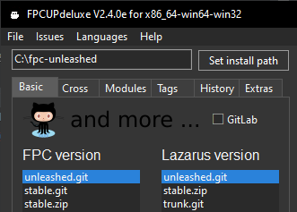

# FPC Unleashed

**FPC Unleashed** is a community-driven fork of **Free Pascal** built for developers who want modern language features today, not after an official release that will likely never include them. The features added here were rejected, ignored, or shelved as "too experimental" by upstream - this fork is your only option for them.

<p align="center">
  
</p>

## Quick Start

> [!TIP]
> Always compile with `-O4`. The new optimization passes added by this fork (store merging, case clustering, cross-jumping, hot/cold block layout, code sinking, ...) only run at `-O4` - without it you get a stock-FPC level of optimization.

### Compiling an existing Pascal program

If you installed via the [official installer or fpcupdeluxe](#installation), the `fpc` in your install directory already is the Unleashed compiler - just make sure you invoke *that* one and not a system-wide FPC package that may also be installed:

```bash
/path/to/fpcunleashed/fpc/bin/x86_64-linux/fpc -O4 myprogram.pas
```

From a source checkout, after building (`make all` with a starting FPC 3.2.x on PATH, then `make rtl packages FPC=$PWD/compiler/ppcx64`), use the `fpcu.sh` wrapper in the repository root - it invokes the freshly built compiler with `-O4` and the in-tree unit paths, and works from any directory:

```bash
/path/to/checkout/fpcu.sh myprogram.pas
```

Flags you pass come last and override the defaults (e.g. `fpcu.sh -O1 test.pas` for a quick unoptimized build). The wrapper expands to:

```bash
compiler/ppcx64 -O4 -Furtl/units/x86_64-linux "-Fupackages/*/units/x86_64-linux" myprogram.pas
```

(The `*` in the unit path is expanded by the compiler itself, hence the quotes. On Windows there is no wrapper: call `compiler\ppcx64.exe` with these flags directly, with unit directories ending in `x86_64-win64`.)

Verify you got the right compiler with `fpc -iV` / `ppcx64 -iV`: it must report **3.3.1**, not the 3.2.x of a distro package.

### Compiling a Lazarus program

Use [Lazarus Unleashed](https://github.com/fpc-unleashed/lazarus) built against this compiler (the [installer or fpcupdeluxe](#installation) set this up for you - the LCL must be compiled by the same compiler that builds your project):

1. In the IDE, open **Project → Project Options → Compiler Options → Compilation and Linking** and set the optimization level to `-O4` (or add `-O4` under **Custom Options**).
2. Build and run as usual - the IDE already invokes the Unleashed compiler.

From the command line, build the project with `lazbuild`, pointing it at the Unleashed compiler explicitly:

```bash
/path/to/lazarus/lazbuild --compiler=/path/to/fpcunleashed/fpc/bin/x86_64-linux/fpc myproject.lpi
```

If the IDE should use a different compiler than the one it was installed with, set it under **Tools → Options → Environment → Files → Compiler executable**.

## Table of Contents

- [Quick Start](#quick-start)
- [Features](#features)
  - [Unleashed Mode](#unleashed-mode)
  - [Statement Expressions](#statement-expressions)
  - [Inline Variables](#inline-variables)
  - [Anonymous Tuples](#anonymous-tuples)
  - [Match Statement](#match-statement)
  - [Multi-Variable Initialization](#multi-variable-initialization)
  - [Flexible Array Members](#flexible-array-members)
  - [Composable Records](#composable-records)
  - [Static Variables](#static-variables)
  - [Scoped Cleanup (defer, autofree, scoped with)](#scoped-cleanup)
  - [For-Step](#for-step)
  - [Tweaks](#tweaks)
  - [Multiline Strings](#multiline-strings)
  - [String Interpolation](#string-interpolation)
  - [Array Equality](#array-equality)
  - [Strip RTTI](#strip-rtti)
  - [Indexed Labels](#indexed-labels)
  - [Lazy Label Declarations](#lazy-label-declarations)
  - [Compound Assignment for Pascal Operators](#compound-assignment-for-pascal-operators)
  - [Custom Binary Metadata](#custom-binary-metadata)
  - [Compile-Time Directives](#compile-time-directives)
  - [Extra Improvements](#extra-improvements)
  - [Detailed Documentation](#detailed-documentation)
- [Installation](#installation)
- [Contributing](#contributing)

---

## Features

### Unleashed Mode

**Activate:** `{$mode unleashed}` or `-Munleashed`

A modern Pascal mode based on `objfpc` with powerful enhancements enabled by default. Instead of toggling individual modeswitches, you get everything at once.

When using **[Lazarus Unleashed](https://github.com/fpc-unleashed/lazarus)**, this mode is enabled by default for all projects and full code completion is supported out of the box.

The following modeswitches are enabled automatically:

| Modeswitch                         | Description                                                   |
| ---------------------------------- | ------------------------------------------------------------- |
| `statementexpressions`             | Use `if`, `case`, and `try` as expressions                    |
| `inlinevars`                       | Declare variables inline anywhere inside a `begin..end` block |
| `staticsection`                    | Body-level `static` declaration block (typed-const-style, writeable, optional initializer) |
| `inlinestatic`                     | Inline `static name := expr;` declarations anywhere inside a body |
| `tuples`                           | Anonymous tuple types, literals, and destructuring            |
| `match`                            | Pattern matching with first-match semantics                   |
| `multivarinit`                     | Initialize several variables of the same type with one value  |
| `forstep`                          | `step N` clause in `for` loops to advance by N each iteration |
| `anonymousfunctions`               | Anonymous procedures and functions                            |
| `functionreferences`               | Function pointers that capture context                        |
| `advancedrecords`                  | Records with methods, properties, and operators               |
| `arrayoperators` + `arrayequality` | Direct array comparisons with `=` and `<>`                    |
| `ansistrings`                      | Use `AnsiString` as the default string type                   |
| `underscoreisseparator`            | Allow underscores in numeric literals (`1_000_000`)           |
| `duplicatelocals`                  | Allow reusing identifiers in limited scopes                   |
| `multilinestrings`                 | Allow multi-line string literals without manual concatenation |
| `interpolatedstrings`              | `$'Hello {name}, age {age:%2d}'` placeholders                 |
| `stringordcast`                    | Cast a string literal to an ordinal type (`dword('RIFF')`)    |
| `autofree`                         | `defer STATEMENT`, `autofree EXPR`, scoped `with var x := ...` |
| `flexiblearrays`                   | C99-style flexible array member as last record field (`array[] of T`) |
| `typehelpers` + `multihelpers`     | Multiple type helpers per type, including primitive types     |

> [!NOTE]
> For the best code-completion experience, we recommend using **[Lazarus Unleashed](https://github.com/fpc-unleashed/lazarus)** - a fork of Lazarus with full support for unleashed mode. If you are using stock Lazarus, enable the mode via `-Munleashed` in the project's Custom Options instead of placing `{$mode unleashed}` directly in the source file, to avoid autocomplete issues and incorrect Code Insight behavior.
---

### Statement Expressions

**Activate:** available in Unleashed mode.

Allows using `if`, `case`, and `try` as **expressions** that return a value, enabling a more functional and concise coding style. All branches must return values of the same type.

#### What it does

Traditionally, `if`, `case`, and `try` are statements - they perform actions but don't produce a value. With statement expressions, they can be used on the right side of an assignment, as function arguments, or anywhere an expression is expected.

#### If expression
```pascal
var
  s: string;
begin
  s := if 0 < 1 then 'Foo' else 'Bar';
  // s = 'Foo'
end.
```

Chained if-expressions work as expected:
```pascal
s := if x > 100 then 'large' else
     if x > 10  then 'medium' else
     'small';
```

Only one branch is evaluated - side effects in the other branch are never triggered:
```pascal
function loadFromDatabase: string;  
begin  
  result := 'data';  
end;

var useCache := false;
var s := if useCache then 'cached' else loadFromDatabase;
// expensive is only called when condition is false
```

#### Case expression
```pascal
type
  TMyEnum = (mefirst, mesecond, melast);
var
  s: string;
begin
  s := case mesecond of
    mefirst:  'Foo';
    mesecond: 'Bar';
    melast:   'FooBar';
  end;
  // s = 'Bar'
end.
```

#### Ranges

```pascal
s := case x of
  0:    'zero';
  1..9: 'single digit';
  else  'large';
```

> [!NOTE]
> When using enums, all values must be covered. Otherwise, the compiler will reject the expression. When using integer or ordinal ranges, provide an `else` clause.

#### Try expression

Evaluates a function call and returns a fallback value if an exception occurs:
```pascal
function conditionalthrow(doraise: boolean): string;
begin
  result := 'OK';
  if doraise then raise TObject.Create;
end;

var
  s: string;
begin
  s := try conditionalthrow(false) except 'Error';
  // s = 'OK'

  s := try conditionalthrow(true) except 'Error';
  // s = 'Error'

  // match specific exception types:
  s := try conditionalthrow(true) except on o: TObject do 'TObject' else 'Error';
  // s = 'TObject'
end.
```

> [!NOTE]
> The `try` expression must contain a function call - `try 'literal' except ...` is not valid.

---

### Inline Variables

**Activate:** available in Unleashed mode.

Declare variables at the point of use inside `begin..end` blocks instead of in a separate `var` section at the top. Supports explicit types and type inference.

#### What it does

In standard Pascal, all variables must be declared in a `var` section before the `begin` keyword. Inline variables let you declare them exactly where they are needed, reducing visual distance between declaration and use, and enabling type inference from the initializer.

#### Basic declarations
```pascal
begin
  // explicit type, no initializer
  var x: integer;
  x := 10;

  // explicit type with initializer
  var y: integer := 42;

  // type inference - compiler deduces integer from the literal
  var z := 100;

  // string inference
  var s := 'hello';

  // multiple variables of the same type
  var a, b: integer;
  a := 1;
  b := 2;
end.
```

#### For loops
```pascal
var
  sum: integer;
begin
  sum := 0;

  // explicit type
  for var i: integer := 1 to 5 do
    sum := sum + i;

  // type inference
  for var j := 1 to 5 do
    sum := sum + j;
end.
```

#### For-in loops
```pascal
var
  arr: array[0..2] of integer = (10, 20, 30);
  sum: integer;
begin
  sum := 0;
  for var item in arr do
    sum := sum + item;
  // sum = 60
end.
```

> [!NOTE]
> Inline variables have the same scope as regular local variables - they are visible from the point of declaration until the end of the enclosing routine. They are not block-scoped.

> [!NOTE]
> Untyped numeric inline variables default to a 32-bit signed integer (`integer`).

---

### Anonymous Tuples

**Activate:** available in Unleashed mode (modeswitch `tuples`).

Lightweight anonymous record types written in parentheses, with literals, destructuring, comparison, and full record semantics (managed types, copy by value, passing by `var`/`const`). Tuples are stored as ordinary internal records, so anything records can do, tuples can do.

#### Positional fields (auto-named `_1`, `_2`, ...)

```pascal
function GetPair: (integer, integer);
begin
  Result := (10, 20);     // positional literal
end;

var
  p: (integer, string) := (42, 'hello');
begin
  writeln(p._1, ' ', p._2);  // 42 hello
  writeln(p[0], ' ', p[1]);  // same, by constant index
end.
```

#### Named fields

```pascal
function Coords: (x, y: integer);
begin
  Exit(x: 10, y: 20);     // shorthand inside Exit
end;
```

#### Destructuring

```pascal
var
  a, b: integer;
begin
  (a, b) := GetPair;       // unpack tuple into existing vars
end.
```

See [unleashed/docs/tuples.md](unleashed/docs/tuples.md) for the full grammar (named/positional mixing, tuple arrays, comparison operators, IDE hints).

---

### Match Statement

**Activate:** available in Unleashed mode (modeswitch `match`).

Pattern matching with first-match semantics. Replaces `case..of` for non-ordinal subjects (tuples, strings, arbitrary expressions) and adds catch-all, fallthrough, condition-based branches, tuple wildcards, and an expression form.

#### Subject form

```pascal
match s of
  'hello': writeln('greeting');
  'bye':   writeln('farewell');
  _:       writeln('unknown');     // catch-all
end;
```

#### Condition form (no `of`)

```pascal
match
  x > 100: writeln('big');
  x > 10:  writeln('medium');
  x > 0:   writeln('small');
  _:       writeln('non-positive');
end;
```

#### Tuple patterns with wildcards

```pascal
var p: (integer, integer) := (0, 5);
match p of
  (0, 0): writeln('origin');
  (0, _): writeln('on Y axis');     // matches
  (_, 0): writeln('on X axis');
  _:      writeln('other');
end;
```

#### Expression form

```pascal
var label_: string := match x of
  1: 'one';
  2: 'two';
  _: 'many';
end;
```

See [unleashed/docs/match.md](unleashed/docs/match.md) for fallthrough mode (`match all`), `leave`, range patterns, and exhaustiveness rules.

---

### Multi-Variable Initialization

**Activate:** available in Unleashed mode (modeswitch `multivarinit`).

Initialize several variables of the same type with a single value in one declaration. Works in `var`, typed constants, and inline `var`. Each variable gets its own independent copy.

```pascal
var
  a, b, c: integer = 42;             // global var
  ok, done: boolean = false;

const
  MinX, MinY, MinZ: integer = 0;     // typed constants

procedure Bar;
begin
  var p, q: integer := 99;           // inline var
  var i, j   := 10;                  // inline var with inference
end;
```

The initializer is evaluated once and copied into each variable; `a := 100` does not affect `b` or `c`. See [unleashed/docs/multi-var-init.md](unleashed/docs/multi-var-init.md) for the full evaluation table.

---

### Flexible Array Members

**Activate:** available in Unleashed mode (modeswitch `flexiblearrays`).

C99-style records with a variable-length tail. The last field is declared with empty brackets and no upper bound; the record header has a fixed size, the tail extends as far as the allocation says, and `sizeof(rec)` reports only the fixed part.

```pascal
type
  PMessage = ^TMessage;
  TMessage = packed record
    code:   integer;
    length: integer;
    data:   array[] of byte;     // flexible array member
  end;

var
  msg: PMessage;
begin
  GetMem(msg, sizeof(TMessage) + 1024);   // header + 1024-byte tail in one block
  msg^.code   := 42;
  msg^.length := 1024;
  msg^.data[1023] := $FF;                 // no range check fires under {$R+}
  FreeMem(msg);
end;
```

The compiler does not track the run-time length, so indexing skips both compile-time and runtime range checks even with `{$rangechecks on}` active. There is no separate buffer, no pointer chase, no managed lifetime.

The pattern is what Win32 headers usually express today as `array[0..0] of T` or `ANYSIZE_ARRAY`, with the well-known problems (range check fires, `sizeof` is one element too large, padding is implicit). FAM gives the inline layout, honest `sizeof`, and a working `{$R+}` in one feature. Common targets: `TOKEN_GROUPS`, `BITMAPINFO`, `LOGPALETTE`, network frames, file headers with inline payload.

Restrictions enforced at parse time: FAM must be the last field of a plain record with at least one preceding field; no FAMs in classes, objects, variant parts, or as `class var` / `threadvar`; FAM-records cannot be embedded in another type, used as array elements, declared on the stack, passed by value, or returned by value. Use `PFamRec` (a pointer) wherever a FAM-record would otherwise live by value.

See [unleashed/docs/flexible-arrays.md](unleashed/docs/flexible-arrays.md) for the full rule list, memory layout diagram, comparison with `array of T`, and PPU notes.

---

### Composable Records

**Activate:** available in Unleashed mode (modeswitch `composablerecords`).

Three composition forms for records: anonymous `embed` of another record type with auto-flatten, inline anonymous record bodies, and `union` blocks for memory overlap. Combined with per-record / per-field size and alignment modifiers, C-style bitfield syntax, and compile-time `OffsetOf` / `BitOffsetOf` / `AlignOf` / `BitAlignOf` intrinsics, this gives Pascal records the layout control that C structs have, without giving up Pascal type safety.

#### Anonymous embed

Fields, methods, properties, and operators of an embedded record flatten into the outer record. The carrier `$compose$N` is hidden; the user sees a flat layout.

```pascal
type
  TVec = record
    x, y: integer;
    function Length: integer;
    class operator + (a, b: TVec): TVec;
  end;
  TPoint = record
    embed TVec;       // x, y, Length, + flatten into TPoint
    z: integer;
  end;

var
  p1, p2: TPoint;
  v: TVec;
begin
  p1.x := 3; p1.y := 4;
  WriteLn(p1.Length);       // method auto-flattened
  v := p1 + p2;             // operator auto-flattened, returns TVec
end;
```

Strict duplicate detection at declaration time catches name clashes across the composition chain, including cascades through nested embeds. RTTI exposes flattened members as if they were direct fields (`TotalFieldCount` reports the flat count, `GetField('x')` resolves through the carrier with the accumulated offset).

#### Inline anonymous record

A `record fields end;` body without a name flattens its members directly into the outer record. Useful for nested layouts when you do not want a named subfield in the way.

```pascal
type
  THeader = record
    sig: longword;
    record
      lo, hi: word;
    end;                  // lo, hi flatten into THeader
    crc: longword;
  end;
```

#### Union (memory overlap)

`union ... end;` is a memory overlap block - all variants share the same offset. Cleaner than legacy `case TAG of` when you only want the overlay, not the discriminator.

```pascal
type
  TPacket = record
    code: byte;
    union
      data: byte;
      record cmd, arg: word; end;
    end;
  end;
```

#### Layout modifiers

Pre-body modifiers on `record` and `union`: `align N`, `bitalign N`, `size N`, `bitsize N`, `of T`. Per-field suffix on individual fields: same set. `bitpacked record of T` opens C-style bitfield syntax inside, where `flags: 4;` translates to `flags: T bitsize 4`. `pad N;` is anonymous padding (N bits); `pad 0;` aligns to the next storage-unit boundary.

```pascal
type
  TFlags = bitpacked record of byte
    a, b: 1;             // C-style: each is 1 bit of byte
    pad 2;               // anonymous 2-bit gap
    nibble: 4;
  end;

  TAligned = record align 64
    data: array[0..7] of qword;   // cache-line aligned
  end;
```

#### Compile-time introspection

```pascal
WriteLn(OffsetOf(TPoint.z));      // 8 - byte offset, composition-aware
WriteLn(BitOffsetOf(TFlags.nibble));  // 4 - bit offset
WriteLn(AlignOf(TAligned));       // 64
WriteLn(BitSizeOf(TFlags.a));     // 1 - per-field bitsize override
```

#### Aligned heap

`GetMemAligned` / `AllocMemAligned` / `ReAllocMemAligned` / `FreeMemAligned` in the `system` unit allocate heap memory honouring a record's `align N` clause (default `GetMem` returns 16-byte aligned only). No `uses` clause required.

See [unleashed/docs/composable-records.md](unleashed/docs/composable-records.md) for the full reference: all three forms, every modifier, the C-style bitfield grammar, intrinsics catalogue, generic interaction, RTTI publication, PPU layout, visibility and shadowing rules, and real-world WinAPI port examples (`SYSTEM_INFO`, `MEMORYSTATUSEX`).

---

### Static Variables

**Activate:** available in Unleashed mode (modeswitches `staticsection` and `inlinestatic`).

A writeable `static` storage class with program-wide lifetime and block-local scope - the same idea as C's `static int x;` inside a function. Two flavors share the keyword:

- A **declaration block** parallel to `var` / `const`, taking compile-time initializers; zero runtime cost (data segment).
- A **single-statement inline form** anywhere in a body, taking runtime initializers; one-shot guard so the expression evaluates once on the first reach per call site.

#### Section static

```pascal
procedure Bumper;
static
  cnt: Integer = 0;       // explicit value
  greet: string;          // zero-init
  ratio := 3.14;          // inferred type
begin
  Inc(cnt);
  WriteLn(cnt, ' ', greet, ' ', ratio);
end;

begin
  Bumper;  // 1   3.14
  Bumper;  // 2   3.14
end.
```

#### Inline static

```pascal
function NextId: Integer;
begin
  static next := 1000;            // runs once; cached for the program lifetime
  Result := next;
  Inc(next);
end;
```

Runtime initializers are allowed:

```pascal
procedure ReadConfigOnce;
begin
  static cfg := LoadConfigFromDisk;   // LoadConfigFromDisk runs once
  Use(cfg);
end;
```

Initialization runs once on the first reach via a hidden Boolean guard set true before evaluating the expression: if the initializer raises, the variable keeps its zero bytes and subsequent calls skip the init block - no retry.

`static` is rejected at unit / program level - use plain `var`, which already gives program lifetime and is visible at that scope.

See [unleashed/docs/static-section.md](unleashed/docs/static-section.md) for the full reference: type inference rules, initializer semantics, guard behaviour on exceptions and recursion, multi-name declarations, and edge cases.

---

### Scoped Cleanup

**Activate:** available in Unleashed mode (modeswitch `autofree`).

Three cooperating constructs for scope-based resource management without `try..finally` boilerplate.

#### `defer STATEMENT`

Register a statement to fire when the enclosing `begin..end` block exits (normal exit, `exit`, `break`, `continue`, exception). Multiple defers fire in LIFO order. Argument expressions are evaluated at exit, not at registration.

```pascal
procedure CopyFile(const src, dst: string);
begin
  var fin  := TFileStream.Create(src, fmOpenRead);
  defer fin.Free;
  var fout := TFileStream.Create(dst, fmCreate);
  defer fout.Free;

  fout.CopyFrom(fin, 0);
end;
// fout.Free runs first (LIFO), then fin.Free, even if CopyFrom raises
```

#### `autofree EXPR`

Sugar that registers a nil-guarded `Free` defer for a class instance. Works on inline-var declarations and on assignments to existing locals. The cleanup uses `if x<>nil then begin x.Free; x:=nil end`, so manual `x.Free; x := nil;` earlier in the scope does not double-free.

```pascal
procedure foo;
begin
  var list := autofree TStringList.Create;
  list.Add('hello');
  list.Add('world');
  WriteLn(list.Text);
end;
// list.Free called automatically here

// also works on existing variables
var
  a, b: TFoo;
begin
  a := autofree TFoo.Create(1);
  b := autofree TFoo.Create(2);
  // ... use a, b ...
end;
// b.Free, then a.Free (LIFO)
```

The right-hand side must be a class derived from `TObject`. The LHS must be a plain local or inline variable.

#### Scoped `with`

The `with` statement accepts inline-var bindings, with optional `autofree`. Three forms:

```pascal
// inline-var with autofree (cleanup at end of with-scope)
with var http := autofree TFPHTTPClient.Create(nil) do
  s := http.Get('http://httpbin.org/ip');

// bind to an existing local
var http: TFPHTTPClient;
with http := autofree TFPHTTPClient.Create(nil) do
  s := http.Get('http://httpbin.org/ip');

// hidden holder (no name; methods reachable through with-symtable)
with autofree TFPHTTPClient.Create(nil) do
  s := Get('http://httpbin.org/ip');
```

Multi-with works with any combination:

```pascal
with var a := autofree TFoo.Create,
     var b := autofree TBar.Create do
  Use(a, b);
// b.Free, then a.Free
```

`defer` written inside a scoped-with body is scoped to that `with` (fires before the autofree cleanup), even when the body is a single statement without `begin..end`.

The classic `with X do BODY` (no inline-var, no autofree) is unchanged.

See [unleashed/docs/autofree.md](unleashed/docs/autofree.md) for the full grammar, lowering details, error catalogue, and edge cases.

---

### For-Step

**Activate:** available in Unleashed mode (modeswitch `forstep`).

Advance the loop counter by an arbitrary positive amount on each iteration with the `step` clause. Works with both `to` and `downto`, and with inline `var`.

`step` is a **context-sensitive keyword** - it is only recognized between the `to`/`downto` expression and `do`. Anywhere else (variable name, function name, record field) `step` stays an ordinary identifier, so existing code with a `step` symbol keeps compiling. Even mixed: `for i := 0 to step step 1 do` parses correctly - the upper bound is the `step` variable, the keyword `step` introduces the increment.

```pascal
for i := 1 to 10 step 2 do
  write(i, ' ');                  // 1 3 5 7 9

for i := 20 downto 1 step 3 do
  write(i, ' ');                  // 20 17 14 11 8 5 2

for var k := 5 to 50 step 5 do
  write(k, ' ');                  // 5 10 15 ... 50
```

The step expression must be of an ordinal type and must be a positive integer. Use `downto` for descending loops; the step itself is always positive. The expression is evaluated **once** before the loop starts, so calls with side effects fire only one time:

```pascal
for i := 0 to 12 step ComputeStep() do  // ComputeStep called exactly once
  ...
```

Constant `step 1` folds back to a regular for-loop, so all the usual optimizations apply. `break`, `continue`, `exit` and `raise` work the same as in a regular for loop. `step` is rejected in `for-in` loops.

---

### Tweaks

**Activate:** unleashed-mode-only (no separate modeswitch).

Small semantic adjustments to make existing Pascal constructs behave the way most people expect them to.

#### Preserved for-loop counter

In standard Pascal the for-loop counter is *undefined* after the loop exits - the optimizer is free to leave any value behind, and Delphi/FPC docs explicitly warn not to rely on it. That bites every time you write `for i := 1 to N do if X then break;` and then try to use `i`.

In Unleashed mode the counter is guaranteed to keep its last assigned value:

```pascal
for i := 1 to 100 do
  if X[i] = target then
    break;
{ i now holds the index of the match (or 100 if nothing matched) }

for i := 1 to 10 do ;
{ i = 10 (the last in-range value), not 11 (overshoot) }
```

This matches the intuitive behavior of C, Python, JavaScript and Go. Cost is one extra assignment on the natural exit path; nothing on `break`/`continue`/`exit`.

#### `is not` and `not in` operators

Delphi-style shorthand for negated runtime type checks and set membership tests:

```pascal
if Obj is not TFoo then ...           // same as: if not (Obj is TFoo)
if x not in [Apple, Orange] then ...  // same as: if not (x in [Apple, Orange])
```

Compiles to the same node tree as the parenthesised form, so semantics and runtime cost are unchanged. Available in unleashed mode only.

See [unleashed/docs/tweaks.md](unleashed/docs/tweaks.md) for the catalogue and the exact rules each tweak applies.

---

### Multiline Strings

**Activate:** available in Unleashed mode (modeswitch `multilinestrings`).

Two delimiter forms let a string literal span multiple source lines without manual `+` or `LineEnding`.

#### Backtick form

```pascal
const
  banner =
`========================================
=         FCF Fibonacci Demo           =
========================================`;
```

A normal string literal extended to tolerate embedded newlines.

#### Triple-quote form

```pascal
const
  sql =
    '''
    select id, name
    from users
    where active = 1
    ''';
```

A Delphi-11-style textblock literal. The opener (`'''` followed by a newline) and the closer (`'''` on its own line) must each sit alone; the indentation of the closing delimiter defines the column that gets stripped from every content line.

The two forms differ in tokenization, indentation handling, and how they compose in expressions. See [unleashed/docs/multiline-strings.md](unleashed/docs/multiline-strings.md) for the details. (Stock FPC actually accepts these too but never documented them.)

---

### String Interpolation

**Activate:** `{$modeswitch interpolatedstrings}` (default in `{$mode unleashed}`)

Embed expressions inside a string literal using `$'...'` and `{expr}` placeholders. No manual `+` chains, no `IntToStr`, no `Format` calls.

```pas
uses SysUtils;
var
  name: string = 'Alice';
  age: integer = 30;
  pi: double = 3.14159;
begin
  WriteLn($'Hello {name}, you are {age} years old.');
  // Hello Alice, you are 30 years old.

  WriteLn($'pi rounded = {pi:%.2f}');
  // pi rounded = 3.14

  WriteLn($'date = {Now:yyyy-mm-dd}');
  // date = 2026-05-29
end.
```

Two placeholder forms:

- `{expr}` - auto-format by type. Scalars (int / float / string / bool / char / enum) pass through. Class instances dispatch to `expr.ToString`, class refs to `ClassName`. Arrays unroll into `[e0, e1, ...]`.
- `{expr:mask}` - mask is the raw text from the first `:` after the expression up to the closing `}`. Picked by mask shape and expr type: `%...` -> `Format`, date/time mask -> `FormatDateTime`, `xN`/`XN` on an ordinal -> `IntToHex`, any other numeric mask on a float or integer -> `FormatFloat` (so `{n:000}` zero-pads). The `Format`/`FormatXxx`/`IntToHex` dispatch requires `uses SysUtils`.

Default locale is **invariant** (English names, `.` decimal). Prefix mask with `L` to opt into the system locale: `{f:L0.00}`.

See [unleashed/docs/string-interpolation.md](unleashed/docs/string-interpolation.md) for the full type x mask dispatch table, escaping rules (`''`, `{{` / `}}`, nested `$'...'`), diagnostics, and notes for users coming from C# / Python f-string / JavaScript template literals.

---

### Array Equality

**Activate:** `{$modeswitch arrayequality}` (requires `arrayoperators` to also be active; both are enabled in `{$mode unleashed}`)

Adds support for `=` and `<>` comparison operators between arrays.

#### What it does

Standard Free Pascal with `arrayoperators` allows `+` (concatenation) on dynamic arrays, but does not allow direct equality comparison. This modeswitch fills that gap - you can compare two arrays element-by-element using `=` and `<>`.

#### Example
```pascal
{$mode unleashed}
var
  a, b: array of integer;
begin
  a := [1, 2, 3];
  b := [1, 2, 3];

  if a = b then
    writeln('Arrays are equal');    // this is printed

  b := [1, 2, 4];
  if a <> b then
    writeln('Arrays are different'); // this is printed
end.
```

---

### Strip RTTI

**Activate:** `{$modeswitch striprtti}`

> [!IMPORTANT]
> This modeswitch is **not** enabled by default in unleashed mode. It must be opted into explicitly.

#### What it does

When enabled, all RTTI strings (type names of custom structures like records, classes, etc.) are stripped from the binary - they are replaced with empty strings. RTTI structures still exist and cannot be fully removed, but the most obvious fingerprint - plain-text type identifiers - is gone.

#### Why

Sometimes one may want to avoid exposing an application's internal structure, especially when a simple ASCII dump can reveal type names and identifiers, and with them, the true purpose of the program.

For instance, in the context of game cheats, embedding a name like `TGameWallhack` in the binary can immediately reveal the nature of the software.

<table><tr><td>
<details>
<summary>📄 $\color{Yellow}{FULL \ CODE \ EXAMPLE \ -\ click \ to\ expand}$</summary>

```pas
program MyCoolCheat;

{$modeswitch striprtti}

type
  TMyAwesomeCheatBase = class
    process_id: dword;
  end;

  TEnemy = record
    playername: string;
  end;

  TTargetList = array of TEnemy;

  TGameAimbot = class(TMyAwesomeCheatBase)
  private
    ftargets: TTargetList;
  public
    property targets: TTargetList read ftargets;
    constructor create;
    procedure addtarget(playername: string);
    procedure start;
    procedure stop;
  end;

  TGameWallhack = class(TMyAwesomeCheatBase)
    enabled: boolean;
  end;

  TCheat = class
    aimbot: TGameAimbot;
    wallhack: TGameWallhack;
    constructor create;
    destructor destroy; override;
  end;

constructor TGameAimbot.create;
begin
  setlength(ftargets, 0);
end;

procedure TGameAimbot.addtarget(playername: string);
var
  newtarget: TEnemy;
  i: integer;
begin
  newtarget.playername := playername;
  i := length(ftargets);
  setlength(ftargets, i+1);
  ftargets[i] := newtarget;
end;

procedure TGameAimbot.start;
begin
end;

procedure TGameAimbot.stop;
begin
end;

constructor TCheat.create;
begin
  inherited;
  aimbot := TGameAimbot.create;
  wallhack := TGameWallhack.create;
end;

destructor TCheat.destroy;
begin
  aimbot.free;
  wallhack.free;
  inherited;
end;

procedure list_enemies(const cheat: TCheat);
var
  enemy: TEnemy;
begin
  for enemy in cheat.aimbot.targets do writeln(enemy.playername);
end;

var
  cheat: TCheat;

begin
  // initialize game cheat
  cheat := TCheat.create;
  // add enemies
  cheat.aimbot.addtarget('Enemy Player');
  cheat.aimbot.addtarget('Another Enemy');
  // enable wallhack and start aimbot
  cheat.wallhack.enabled := true;
  cheat.aimbot.start;
  // print enemies list
  list_enemies(cheat);
  // stop the cheat
  cheat.aimbot.stop;
  cheat.free;
end.
```
</details>
</td></tr></table>

#### ASCII dump comparison

<table>
<tr>
<th>Standard</th>
<th>With <code>{$modeswitch striprtti}</code></th>
</tr>
<tr>
<td valign="top" style="font-size:smaller">
<pre>
Offset Size String
acf0   10   0123456789ABCDEF
af20   29   FPC 3.3.1 [2025/06/18] for x86_64 - Win64
b0d1   13   TMyAwesomeCheatBase
b1c1   0b   TGameAimbot
b2a9   0d   TGameWallhack
b3b8   0c   Enemy Player
b3d8   0d   Another Enemy
b3ea   13   TMyAwesomeCheatBase
b418   0b   MyCoolCheat
b47a   0b   TTargetList
b4aa   0b   MyCoolCheat
b4c2   0b   TGameAimbot
b512   0b   TGameAimbot
b538   0b   MyCoolCheat
b552   0d   TGameWallhack
b57a   0b   MyCoolCheat
b5bb   0b   MyCoolCheat
</pre>
</td>
<td valign="top" style="font-size:smaller">
<pre>
Offset Size String
acf0   10   0123456789ABCDEF
af20   29   FPC 3.3.1 [2025/06/18] for x86_64 - Win64
b398   0c   Enemy Player
b3b8   0d   Another Enemy
</pre>
</td>
</tr>
</table>

Type names like `TGameAimbot`, `TGameWallhack`, or `MyCoolCheat` are no longer present, making the binary significantly less identifiable at first glance. Only actual string data (like player names) remains.

#### Side effects

Compiling a typical LCL application with `striprtti` enabled will likely result in a startup failure, because code such as:
```pascal
application.createform(TForm1, form1);
```

will search for `""` (empty string) in the resources instead of `TForm1`, and fail.

#### Workaround

Three ways are provided to selectively whitelist types that should keep their RTTI name:

**1. `expose` keyword** - placed directly before a type declaration in unleashed mode:
```pascal
type
  expose TForm1 = class(TForm)
    // ...
  end;
```
The keyword is contextual and only recognized in `{$mode unleashed}`. It is parsed even when `striprtti` is off (no-op then), so you can leave the keyword in place while temporarily disabling stripping.

**2. `{$rttiexpose}` directive** - per-unit list of glob patterns. Whitespace and/or comma separated:
```pascal
{$rttiexpose TForm* TButton*, TPanelMain}
```

**3. `--rttiexpose=` CLI flag** - global list of glob patterns, applied to every compiled unit. Repeatable:
```
fpc --rttiexpose=TForm*,TButton* --rttiexpose=TPanelMain ...
```
Useful for whitelisting types you do not control (LCL, RTL).

CLI patterns and per-unit directive patterns are merged (union); the directive can only widen the whitelist for its own unit, never narrow CLI.

> [!NOTE]
> The `{$modeswitch striprtti}` directive works on a per-unit basis. You can enable it only in the units where you want to hide type names, while leaving it disabled in others - for example, in units that contain forms or require RTTI to function correctly.

See [unleashed/docs/strip-rtti.md](unleashed/docs/strip-rtti.md) for the full list of stripped fields, edge cases (forwards, generics, aliases), interaction with PPU, and implementation notes.

---

### Indexed Labels

Labels now support indexes.

#### Example

```pascal
label
  mylabel1,
  mylabel2[1, 2, 3],
  mylabel3[1..10],
  mylabel4['foo', 'bar'];

begin
  goto mylabel4['foo'];

  writeln('you should not see this');

  mylabel1:
  mylabel2[2]:
  mylabel3[10]:
  mylabel4['foo']:

  writeln('hello!');
end.
```

---

### Lazy Label Declarations

Labels no longer need to be declared before use.

#### Example

```pascal
begin
  goto mylabel;

  writeln('you should not see this');

  mylabel:

  writeln('hello!');
end.
```

---

### Compound Assignment for Pascal Operators

Compound assignment is now supported for Pascal operators such as `div`, `mod`, and `xor`, without requiring `{$COPERATORS ON}`.

#### Example

```pascal
var
  i: integer = 10;
begin
  i div= 2;   // equivalent to: i := i div 2
  writeln(i); // prints "5"
end.
```

Available: `div=`, `mod=`, `and=`, `or=`, `xor=`, `shl=` and `shr=` .

---

### Custom Binary Metadata

Three CLI flags override metadata that ends up in the produced binary. Useful for branding releases, hiding the toolchain you used to build the binary, or simply controlling what inspection tools display - it is your binary, set the fields to whatever you want.

- **`--fpcsignature=<str>`** - replaces the ident string in the `.fpc.version` section. Cross-platform; every target emits this section. Default is `FPC Unleashed <version> [<date>] for <cpu> - <target>`. Passing an empty string (`--fpcsignature=`) **drops the section entirely** - the produced binary carries no FPC ident marker at all.
- **`--linkerversion=<Major.Minor>`** - sets `MajorLinkerVersion` / `MinorLinkerVersion` in the PE optional header. Windows PE only. Default derived from FPC version (e.g. `3.31` for FPC 3.3.1).
- **`--osversion=<spec>`** - sets `MajorOperatingSystemVersion` / `MinorOperatingSystemVersion` in the PE optional header. Windows PE only. `spec` is either an OS name (`XP`, `Win11`, `Vista`, `7`, `8.1`, ...) resolved via a built-in table, or numeric `Major.Minor` (`10.0`, `6.3`). Default is `4.0` unless `-WP` is set.

Examples:
```
fpc --fpcsignature="MyApp 1.0" --linkerversion=14.39 --osversion=Win11 my_program.pas
fpc --fpcsignature="FPC" my_program.pas       # keep "FPC", drop version + date
fpc --fpcsignature="" my_program.pas          # no signature section in the binary
fpc --osversion=10.0 my_program.pas
fpc --osversion=XP --linkerversion=14.0 my_program.pas
```

The OS-name table is case-insensitive and accepts an optional `Win` prefix (`Win11`, `WinXP` work just like `11`, `XP`).

> [!IMPORTANT]
> `--linkerversion` and `--osversion` are **Windows PE only** (targets `win32`, `win64`, `wince`). Other binary formats do not carry these fields:
> - **ELF** (Linux, BSD, Solaris, Haiku, Android) - no linker version or OS version in the header.
> - **Mach-O** (macOS, iOS) - has `LC_BUILD_VERSION` / `LC_VERSION_MIN_*` but FPC delegates linking to the system `ld`, which fills these from the SDK.
> - **NE / OMF / WASM / NLM / AmigaOS hunk / Atari TOS** - either no such field or hardcoded for compatibility.
>
> Passing the flags on a non-PE target compiles cleanly but the values are silently ignored. `--fpcsignature` works on every target.

See [unleashed/docs/binary-metadata.md](unleashed/docs/binary-metadata.md) for full per-flag rationale, the OS-name table, and cross-platform notes.

---

### Compile-Time Directives

Source-level directives that perform compile-time work other than mode / modeswitch toggling. Always available - not gated by any modeswitch.

- **`{$incfile NAME 'path'}`** - reads the file at `'path'` as raw bytes and emits `const NAME: String = '...';` at the directive site. Bytes are encoded as printable-ASCII runs joined to `#$nn` escapes for control and high-bit bytes. Path is resolved like `{$I}`: absolute or searched in the current source dir, then the local and global includepath. Useful for baking small fixed assets (icons, schemas, lookup tables) directly into the binary without runtime file I/O.

Example:
```pas
program demo;
{$mode unleashed}
{$incfile icon 'assets/app.ico'}
begin
  // `icon` is a String holding the bytes of assets/app.ico; length(icon) = file size
end.
```

See [unleashed/docs/incfile.md](unleashed/docs/incfile.md) for the full reference.

---

### Extra Improvements

Smaller, targeted improvements that unlock Pascal patterns standard FPC modes reject. Modeswitch entries are on by default in `unleashed` and can be opted into elsewhere via `{$modeswitch name}`; unleashed-only entries have no separate switch.

| Improvement                  | What it does                                                       | Example                                          | Enable                              |
|------------------------------|--------------------------------------------------------------------|--------------------------------------------------|-------------------------------------|
| String-to-ordinal cast       | Cast string literal to integer at compile time                     | `dword('RIFF')`                                  | `stringordcast` (on in unleashed)   |
| Type helpers anywhere        | `type helper for T` on any named type, not just classes/records    | `type helper for integer`                        | `typehelpers` (on in unleashed)     |
| Multi-helpers                | Several helpers for one type visible at once (no "last wins")      | two `helper for integer`, both methods callable  | `multihelpers` (on in unleashed)    |
| Implicit generics            | Delphi-style `<T>` without `generic` / `specialize` keywords       | `TList<integer>`                                 | `implicitgenerics` (on in unleashed)|
| Nested generic methods       | Generic method with its own type parameter inside a generic class  | `function Pair<U>` inside `TBox<T>`              | unleashed-only                      |
| `array[N] of T` shorthand    | `array[N]` = `array[0..N-1]`; multi-dim and ranges mix freely      | `array[10] of integer`, `array[3, 'a'..'z']`     | unleashed-only                      |
| Compound `+=` on properties  | `prop += x` (stock rejects with "Variable identifier expected")    | `f.Count += 5`                                   | unleashed-only                      |
| `inc` / `dec` on properties  | `inc(prop, n)` rewritten to getter + setter                        | `inc(c.N, 5)`                                    | unleashed-only                      |
| `Type()` intrinsic           | Static type of an expression, operand unevaluated                  | `var y: Type(x)`, `Type(a[0])`                   | unleashed-only                      |

Full descriptions, edge cases, and limitations in [unleashed/docs/extra-improvements.md](unleashed/docs/extra-improvements.md).

---

### Detailed Documentation

Each feature has a dedicated reference page in [unleashed/docs/](unleashed/docs/) with the full grammar, semantics, edge cases, and IDE notes. Start at the index: [unleashed/docs/README.md](unleashed/docs/README.md).

## Installation

### Option 1: Official installer (recommended)

Self-contained GUI installer for Windows and Linux that downloads sources, builds the compiler and Lazarus IDE into a directory of your choice, optionally installs cross compilers, and drops a desktop shortcut to the IDE. No PATH changes, no registry side effects, no overwriting of an existing FPC. Re-runs are idempotent - ticking a new cross target or addon does just that surgical change.

- Repo: [fpc-unleashed/installer](https://github.com/fpc-unleashed/installer)
- Downloads: [installer/releases](https://github.com/fpc-unleashed/installer/releases) - tagged stable releases cut on every breaking change, plus a rolling `nightly` that tracks `main`
  - `installer_win64_x86_64.exe` - Windows host
  - `installer_linux_x86_64` / `installer_linux_x86_64.AppImage` - Linux host

Pick the binary for your host, run it, choose an install directory, tick the cross targets you want, click Install. Default install path is `C:\fpcunleashed\` on Windows and `$HOME/fpcunleashed/` on Linux.

### Option 2: Fresh install (FPC + Lazarus via fpcupdeluxe)

1. Download [fpcupdeluxe](https://github.com/LongDirtyAnimAlf/fpcupdeluxe) and run it once to generate the `fpcup.ini` file.
2. Edit `fpcup.ini` and add the following under `[ALIASfpcURL]`:

```ini
[ALIASfpcURL]
unleashed.git=https://github.com/fpc-unleashed/freepascal.git
```

And, for Lazarus Unleashed (with **autocomplete support** for the new features/syntax), add the following under `[ALIASlazURL]`:  

```ini
[ALIASlazURL]
unleashed.git=https://github.com/fpc-unleashed/lazarus.git
```

3. Reopen **fpcupdeluxe**, uncheck **GitLab**
4. As **FPC version** select `unleashed.git`
5. As **Lazarus version** select `unleashed.git`
6. Go to "**Setup+**" and tick "Docked Lazarus IDE"
7. Click **Install/update FPC+Lazarus**
8. Optionally install cross-compilers via the `Cross` tab

> [!IMPORTANT]
> Due to recent changes in the Unleashed IDE, the [b]Docked Lazarus IDE[/b] option in fpcupdeluxe is [b]required[/b]. The default window layout and several other settings are tuned for the docked mode - install without it and you'll have to rearrange the windows (and tweak a few other things) by hand.



### Option 3: Upgrade an existing fpcupdeluxe setup

1. Make sure your existing FPC + Lazarus installation was created with **fpcupdeluxe**.
2. In your installation directory, delete or rename the `fpcsrc` folder.
3. Clone the FPC Unleashed repo into the `fpcsrc` directory:

```bash
git clone https://github.com/fpc-unleashed/freepascal.git fpcsrc
```

4. In **fpcupdeluxe**, go to **Setup+**, check **FPC/Laz rebuild only**, and confirm.
5. Click **Only FPC** to rebuild the compiler and RTL.
6. Optionally install cross-compilers via the `Cross` tab.

## Contributing

We welcome bold ideas and experimental features that push Pascal forward.

**FPC Unleashed** is a home for innovation. If you have built a language feature that was considered _too experimental_ or _not standard enough_ for upstream, this is where it belongs.

### What we are looking for

* **New language ideas** - Propose modeswitches, syntax extensions, or compiler enhancements via GitHub Issues or Discussions. Even if you do not have an implementation yet, a well-described idea with clear use cases is valuable.
* **Complete, high-quality implementations** - We accept pull requests for new language constructs, compiler enhancements, and RTL improvements. We expect production-grade code: clean implementation, proper test coverage, and clear documentation of the feature.

### What we are not looking for

We do not accept minor convenience patches, trivial reformats, or small tweaks that only scratch a personal itch. Every change to a compiler carries weight - if you are contributing code, it should be a meaningful feature or fix that benefits the broader community.
